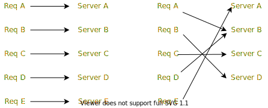
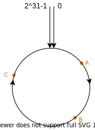
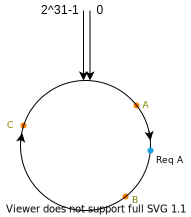
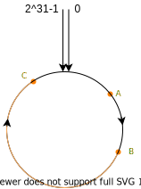
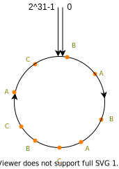
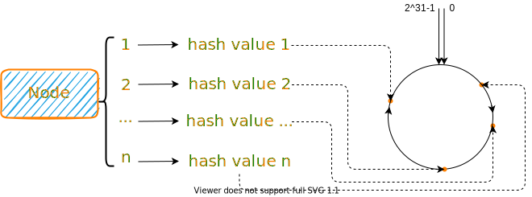

## 一致性哈希
### 安装
```
go get -u github.com/junhaideng/consistent
```

### 使用
```go
c := consistent.New()
ips := []string{"192.168.0.1", "192.168.0.2", "192.168.0.3", "192.168.0.4"}

for _, ip := range ips {
  c.Add(ip)
}

fmt.Println("ip: ", c.Get("/hello.txt"))
```
<hr/>

### 背景
在介绍一致性哈希之前，首先来看看集群部署可能发生的问题：比如说我现在有5台 `Redis` 服务器，正常运行了很久，很不巧有一天A服务器崩溃了，这个时候还有4台服务器，系统还可以正常运行，原来发送到A服务器的请求我们肯定要想办法进行重定向吧，如果说我们使用一般的哈希函数进行分配，无疑是 `hash(key) % num`，不过因为 `num` 现在变成了 `num-1`，那么很有可能所有的请求都会发生改变打到不同的服务器上，原来发送到B的请求重新处理之后可能发送到了C服务器了。



为了规避这种大迁移情况，我们可以使用一致性哈希。

### 算法原理
一致性哈希算法使用的也是取模，但是不同于普通的哈希，我们不是对服务器的数量进行取模，而是对 `2^32` 取模，也就是相当于对一个固定的数进行取模，我们可以这样认为：所有的哈希值空间构成了一个圆环，如下图：


如果我们有多个服务器的，根据某个属性计算哈希值，比如说IP地址，映射到圆环上对应节点，假设说现在我有三个节点，映射之后的结果如下: 


当某个请求发送过来的时候，根据其中的某个属性计算哈希值，比如说`HTTP`请求的路径，头部信息等，假设映射到如下的位置


根据映射到的位置，我们选择`顺时针旋转`遇到的第一个服务器节点作为该请求所选择的服务器节点，也就是 `B` 服务器。

当我们的某台服务器崩溃的时候，比如 `B` 崩溃了，那么 `A` 请求根据一致性哈希原理，会分配到服务器节点 `C`，更一般的，`(A, B]` 范围中的请求都会重新分配到服务器节点 `C`，而其他的请求都不会发生改变，这和之前所述的普通哈希函数不同。

但是上述的算法在某些情况下表现不好，比如说下面的这种服务器节点分布：


`C` 一个节点就占用了大概`2/3`的取值空间，导致请求分配非常不均匀，针对这种情况，我们可以通过设置多个节点副本，如下：


这样处理之后，比之前而言要均匀了很多，理论来说，副本的数量越多，分配的越均匀，但是同时也会增加管理的难度，所以不宜设置过大。


### 算法实现
先简单说一下思路吧，按照上面的原理，我们需要：
- hash 函数：能够支持多副本
- 服务器节点映射：哈希值->服务器节点
- 映射的值范围：类似上面的取值圆环
```go
type consistent struct {
	// 副本数量
	replicas int
	// 所有的server 节点
	nodes map[string]struct{}
	// 节点所对应的server
	servers map[uint32]string
	// 保存所有的索引，也就是在hash圆环上的节点
	circle uints // type uints []uint32
	// 采用的hash算法
	// hash 方法可能直接决定节点的分布情况
	hash Hash
	sync.RWMutex
}
```
当一个服务器节点进行映射的时候，会得到多个哈希值(多个副本)，这些哈希值在圆环上对应一个位置


但是我们没必要保存一个 `2^31-1` 大的数组，我们只需要维护一个`有序数组`就好了，当一个请求过来的时候，我们只需要获取到它的哈希值顺时针的下一个节点哈希值对应的服务器节点就好了

#### 哈希函数
哈希函数应该能够支持多副本，方式有很多种，这里采用一个简单的方式，也可以自定义
```go
import (
	"hash/fnv"
	"strconv"
)

// replica
func hash(key string, num int) uint32 {
	h := fnv.New32()
	h.Write([]byte(key + '-'+ strconv.Itoa(num)))
	return h.Sum32()
}
```

#### 服务器节点映射
服务器节点进行哈希之后，需要保存对应的哈希值，这样可以通过哈希值获取到对应的服务器
```go
servers := make(map[uint32]string)
```

#### 映射值的范围
```go
circle := make([]uint32, 0)
```

每一次添加节点的时候，都需要进行重新排序：
```go
for i := 0; i < replicas; i++ {
  key := hash(node, i)
  circle = append(c.circle, key)
  servers[key] = node
}
// 重新进行排序
sort.Sort(c.circle)
```
而在删除节点的时候，我们只需要删除对应节点的哈希值，顺序维持不变即可。

#### 支持的方法
主要支持的方法不是很多，基本的有：

```go
type ConsistentHasher interface {
	// 添加节点
	Add(slot string)
	// 删除节点
	Delete(slot string)
	// 数据对应的节点
	Get(key string) string
}
```

添加服务器节点上面已经说了，删除节点的主要代码如下：
```go
func (c *consistent) Delete(node string) {
	c.Lock()
	defer c.Unlock()
	// 删除节点
	delete(c.nodes, node)

	// 因为在数组中删除元素不方便，这里先记录一下需要删除的数据
	// 然后如果在这里面的数据就不再添加到新的记录中
	memo := make(map[uint32]struct{})

	// 删除hash圆环中的值
	for i := 0; i < c.replicas; i++ {
		key := c.hashKey(node, i)
		memo[key] = struct{}{}
		delete(c.servers, key)
	}

	// 创建一个新的保存
	newCircle := make(uints, 0, c.circle.Len()-c.replicas)
	for i := 0; i < c.circle.Len(); i++ {
		if _, ok := memo[c.circle[i]]; !ok {
			newCircle = append(newCircle, c.circle[i])
		}
	}
	c.circle = newCircle
}
```

当我们需要获取一个请求对应的服务器节点的时候，我们只要搜索到顺序针第一个服务器节点即可，因为哈希值有序，这里可以采用`二分查找`的方式
```go
// Get 获取到属于的server节点
func (c *consistent) Get(name string) string {
	c.RLock()
	defer c.RUnlock()
	// 首先将hash找到
	key := c.hash(name)
	// 然后在Hash圆环上找到对应的节点
	i := sort.Search(len(c.circle), func(i int) bool { return c.circle[i] >= key })
	
  // 顺时针计算应该就是第一个节点了
  if i >= c.circle.Len() {
		i = 0
	}
	return c.servers[c.circle[i]]
}
```

具体的实现代码已经上传到 [GitHub](https://github.com/junhaideng/consistent) 上了

#### 总结

一致性哈希在加入和删除节点的时候只会影响相邻的节点，对其他的节点无影响。当节点数量发生变化，我们不希望映射关系全部被打乱的时候，可以采用该算法。